# 校园二手书平台

迅速发展和日益成熟的网络已经完全影响到我们生活的各个方面，网络给我们带来了越来越多的便利。但目前校园二手书销售仍主要以线下交易为主，这就会造成信息的封闭，导致定价不合理，市场竞争不规范，书籍的质量无法保证等一系列问题
建立了校园二手书交易平台，对于消费者来说，平台的建立满足了消费者的需求
让他们更方便的以网上购买的方式购买到所需要的图书，同时图书的价格质量能够经过比对进行选择，更加的放心。对于销售者来说，不用自己寻找买家，只需在平台上上架即可完成出售，这让旧书得以重复利用，绿色环保

## 项目技术介绍

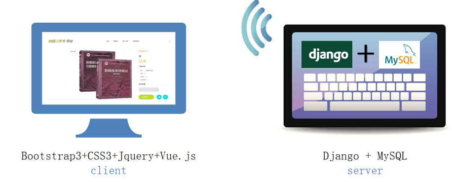

## 项目功能介绍

登陆注册以及退出登录：提供完善的账户流体系结构
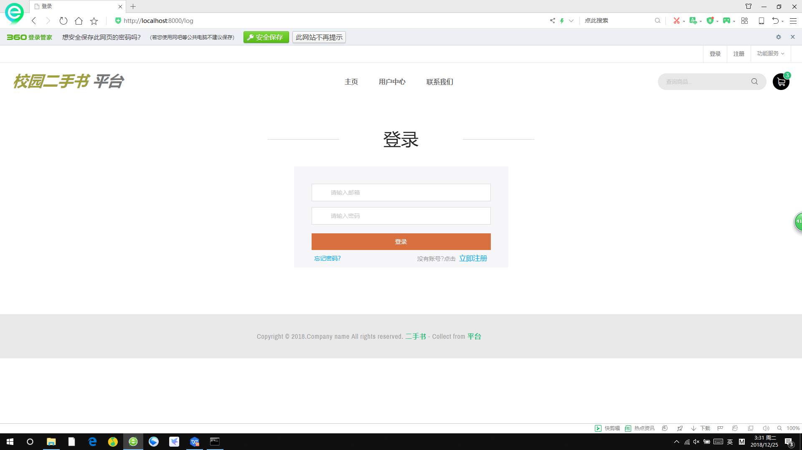
我的信息：点击即可查看到用户全部个人信息
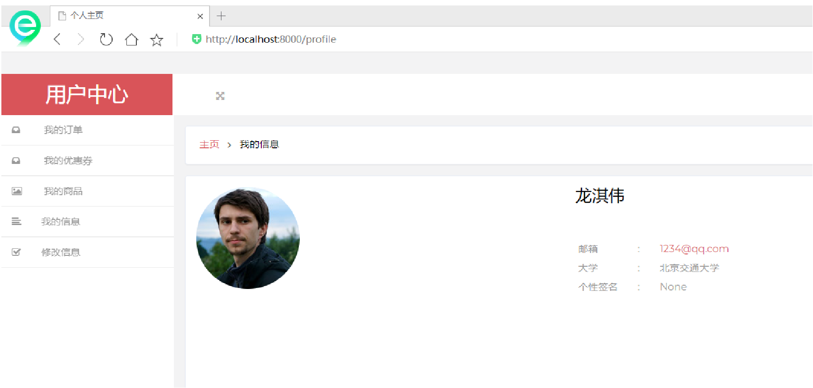
修改信息：输入自己想要修改的个人信息并提交保存，即可实时修改同步自己的个人信息
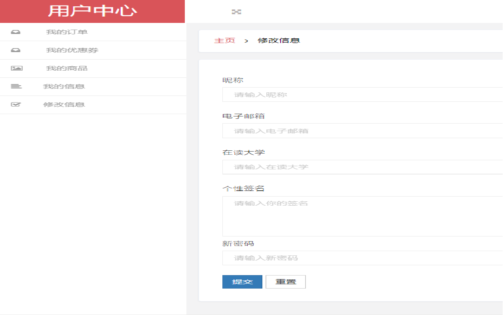
用户管理：利用管理员权限创建用户，最新登录总览，搜索用户等操作
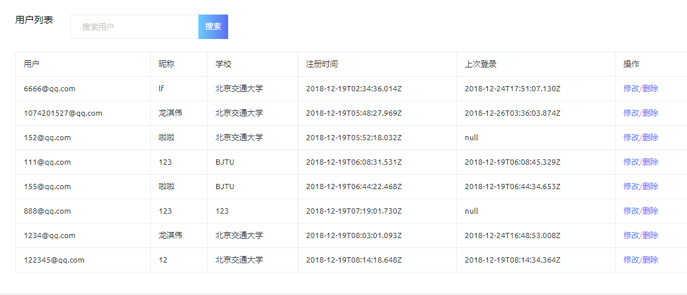
商品管理：查看当前所有在售商品，并查看商品详情，删除违规商品

主页活动轮播:以图片海报轮播的方式宣传现阶段正在进行的活动
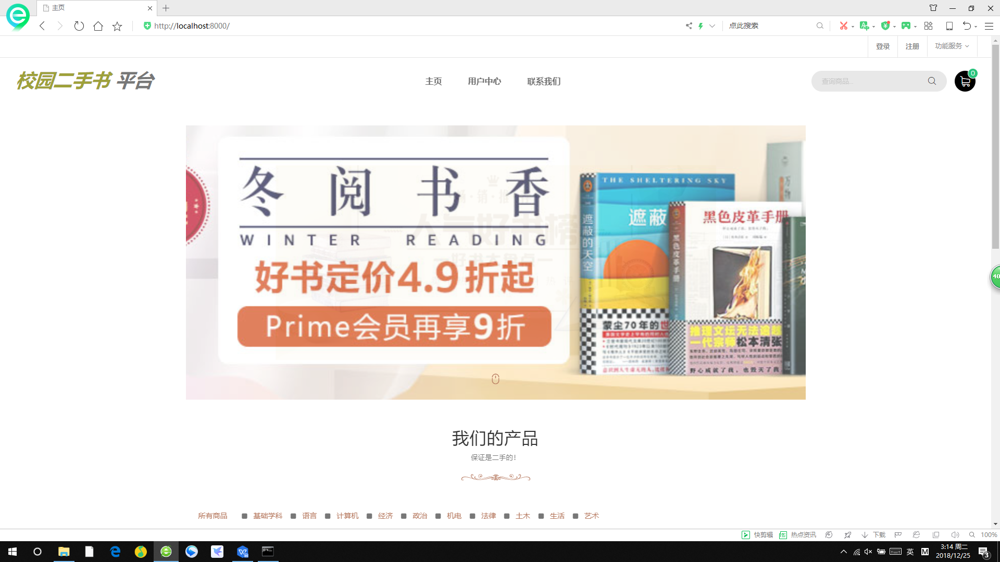
活动管理（活动中心）：发布新的活动，查看或删除已有的活动
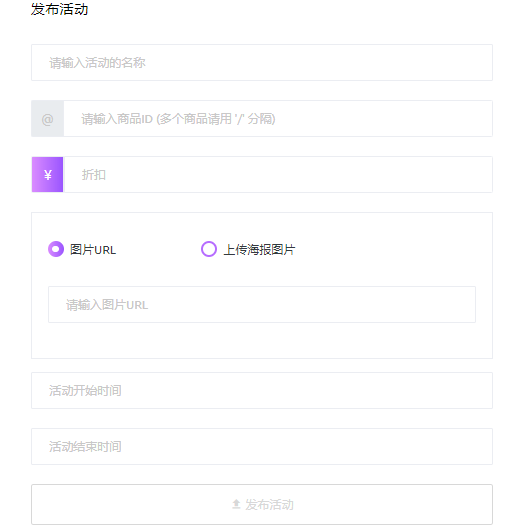
公告展示：展示管理员所发布的最近公告，包含标题以及详细内容
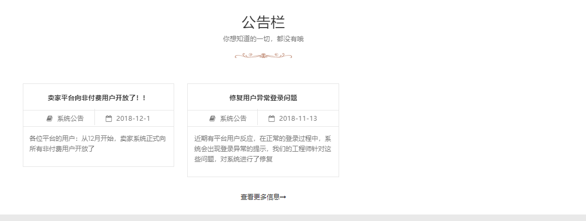
公告管理：发布新的公告查看或删除当前的系统公告
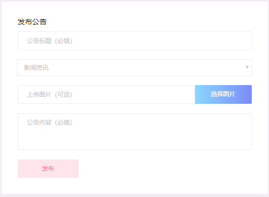
我的商品：展示自己已上架的所有在售商品，点击加号可以发布新的商品（上传实拍图可选）
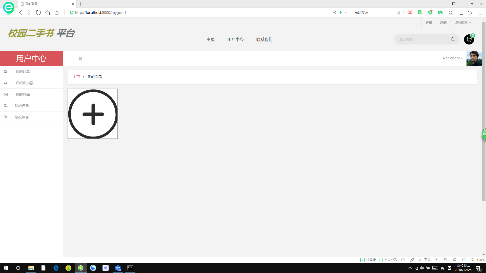
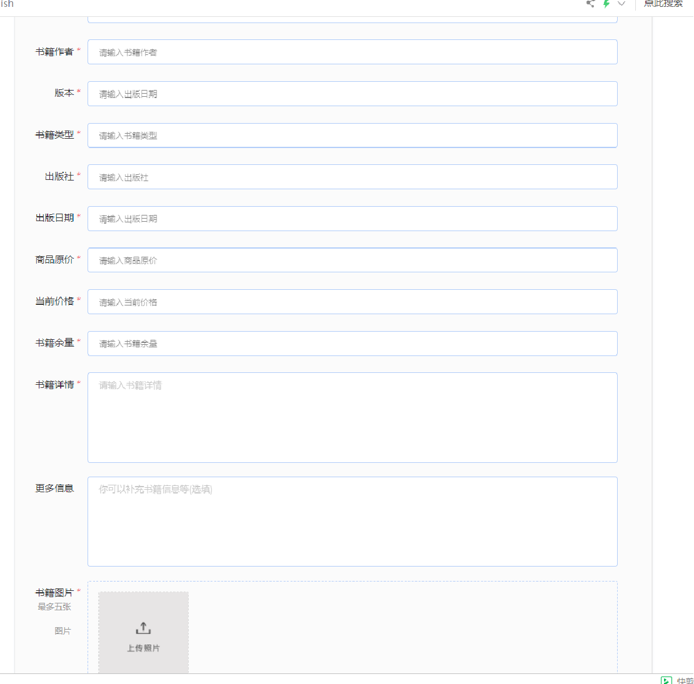
商品分类（及展示）：将所有商品按常见学科分类，便于筛选
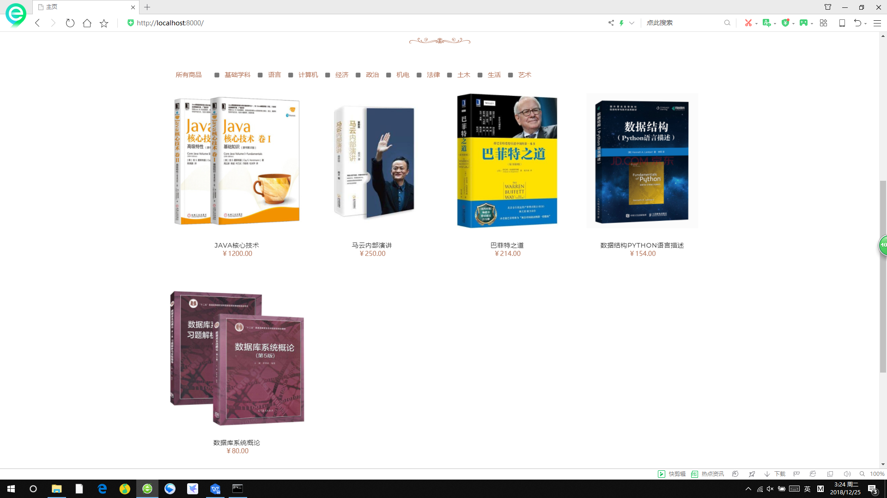
我的订单：展示自己已购买的所有书籍订单信息
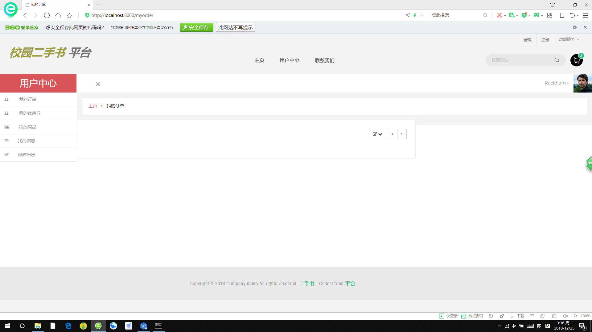
数据总览：浏览成交金额，订单总数，注册用户数量，最近订单等必要统计数据
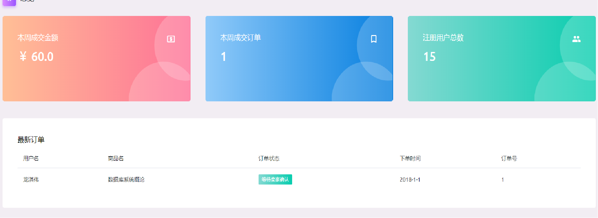
我的优惠券：展示出自己领取的所有可用优惠券
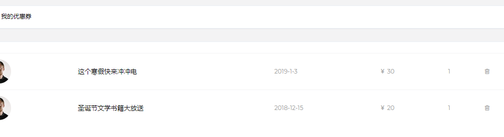
购物车
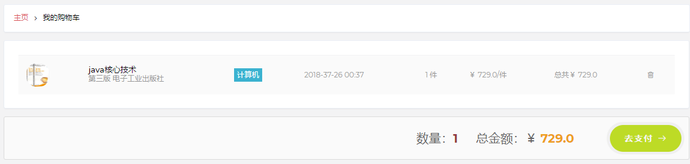
活动管理（优惠券管理）：添加新的优惠券
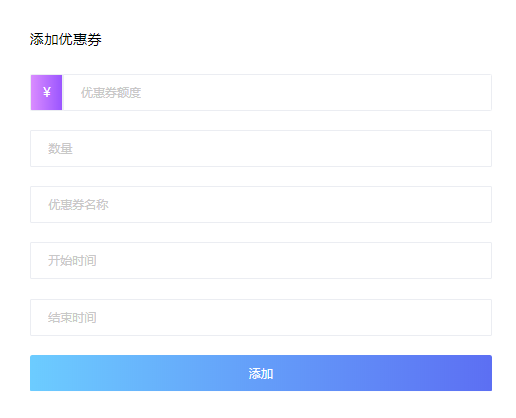
商品基本信息：罗列出该书籍的详细信息，如简介、作者、出版社等
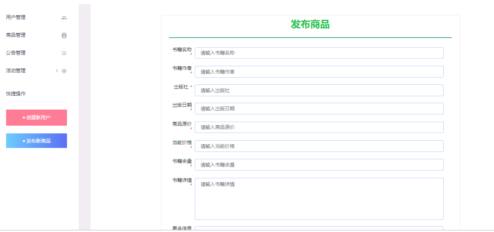
加入购物车:
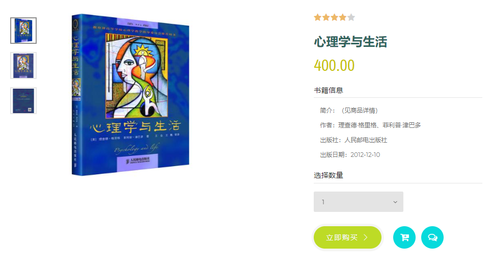
用户评价：展示已购买过该商品的用户对商品的评价
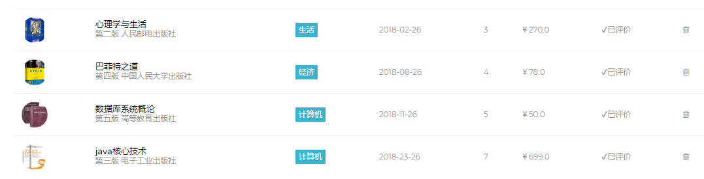
